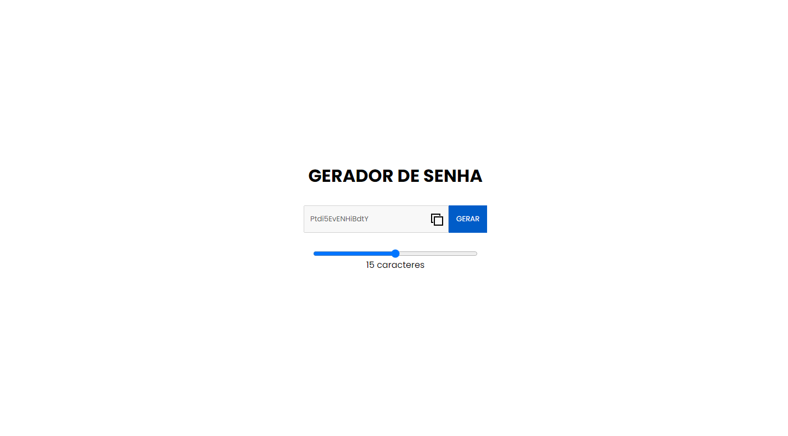

# Generate-Password
Para testar meus conhecimentos em JavaScript eu fiz esse gerador de senha. Aonde ele gera senhas completamente aleatórias, com algumas funcioalidades extras!!!!]

<h1>Welcome! 👋</h1>

<h2>The challenge</h2>

Link para testar o projeto : <a href="https://generate-password-s.netlify.app/">Gerador de Senha</a> - RESPONSIVO ✔️

<ul>

Nesse Projeto Usei as seguintes tecnologias :

<li>HTML
<li>CSS
<li>JavaScript
<li>Git
<li>Github
<li>Node.js
</ul>
 
 
 
Ideia fornecida por: [Frontend Mentor]

